# Metamask extension flow

0. Install extension

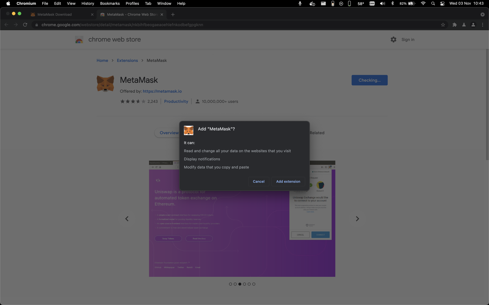

1. Welcome

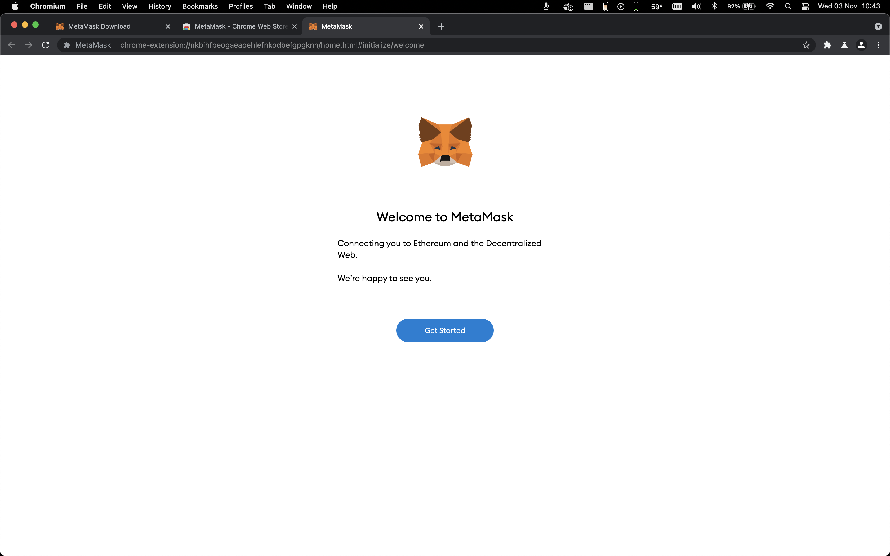

2. Import or create wallet

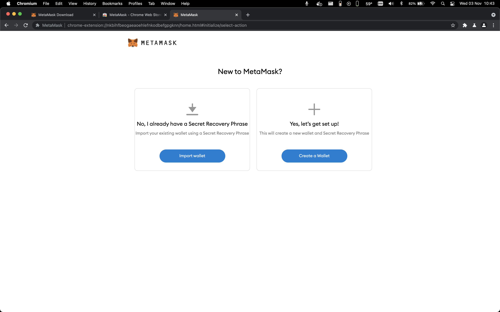

3. Data collection opt-in

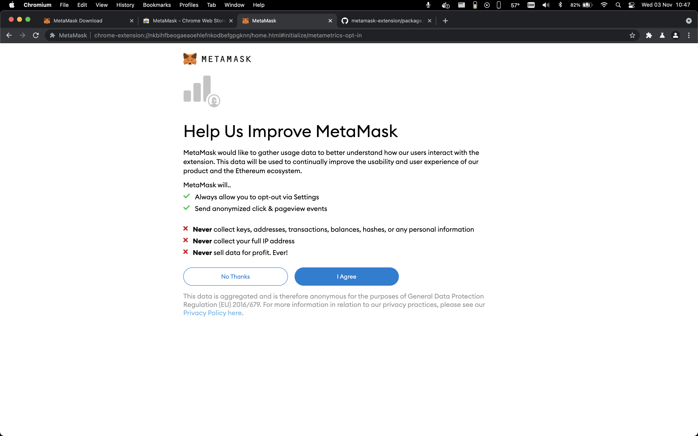

4. Create password

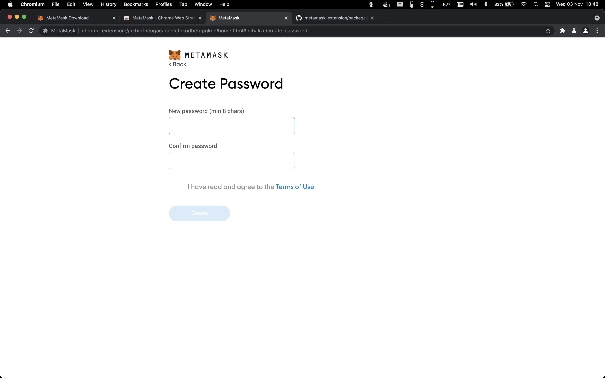

5. Tutorial

6. Recovery phrase

7. Confirm recovery phrase

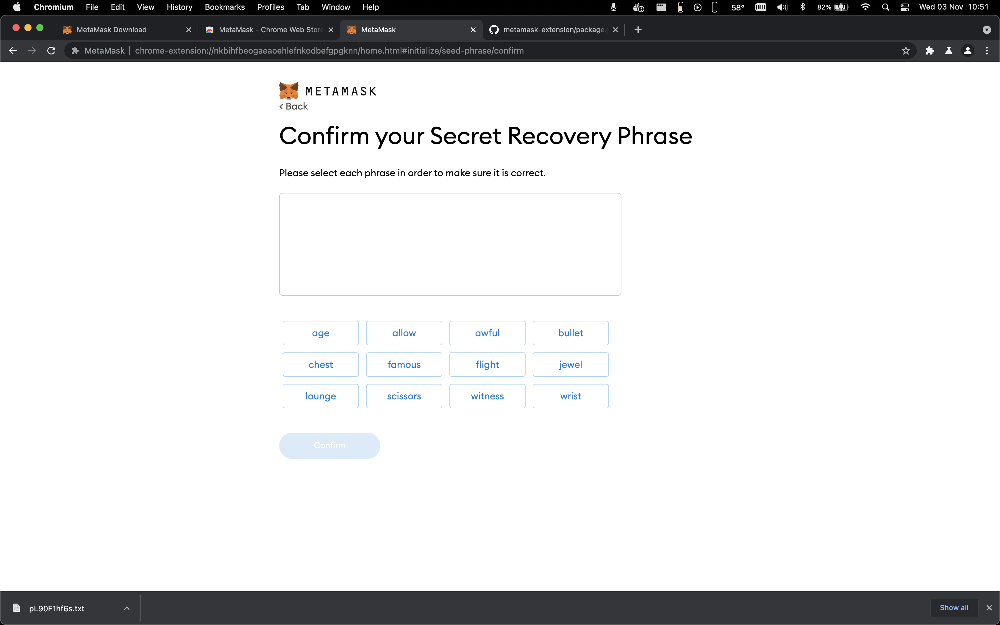

8. Tips

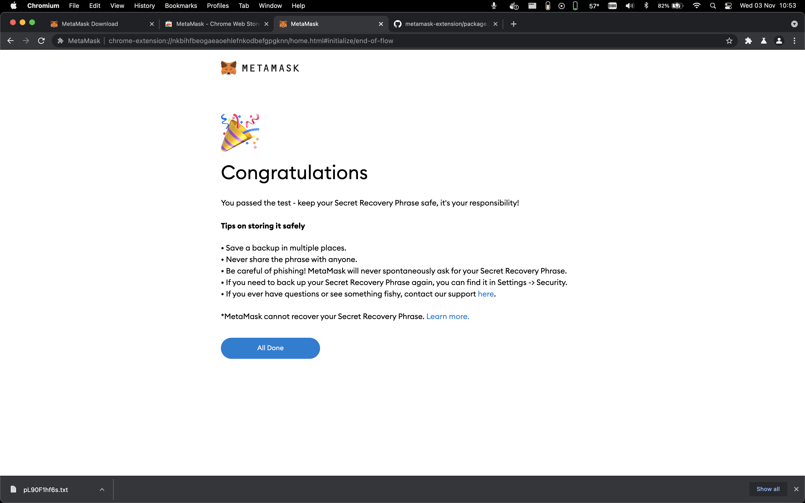

9. What's new modal

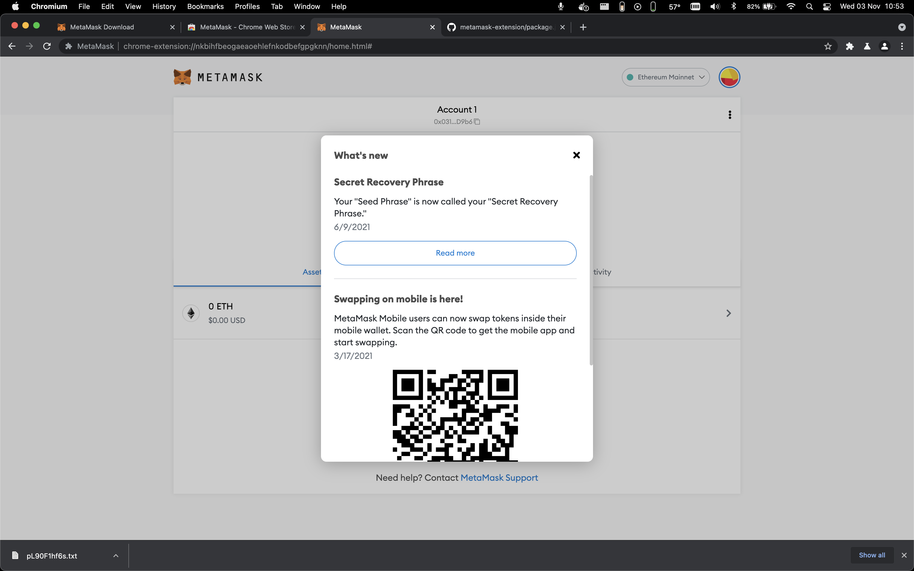

10. Wallet Dashboard

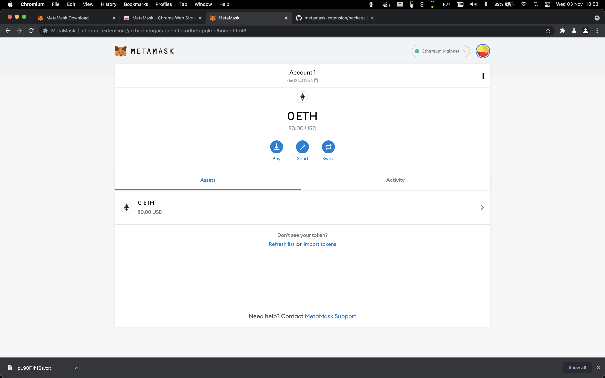

11. External site connect with metamesk

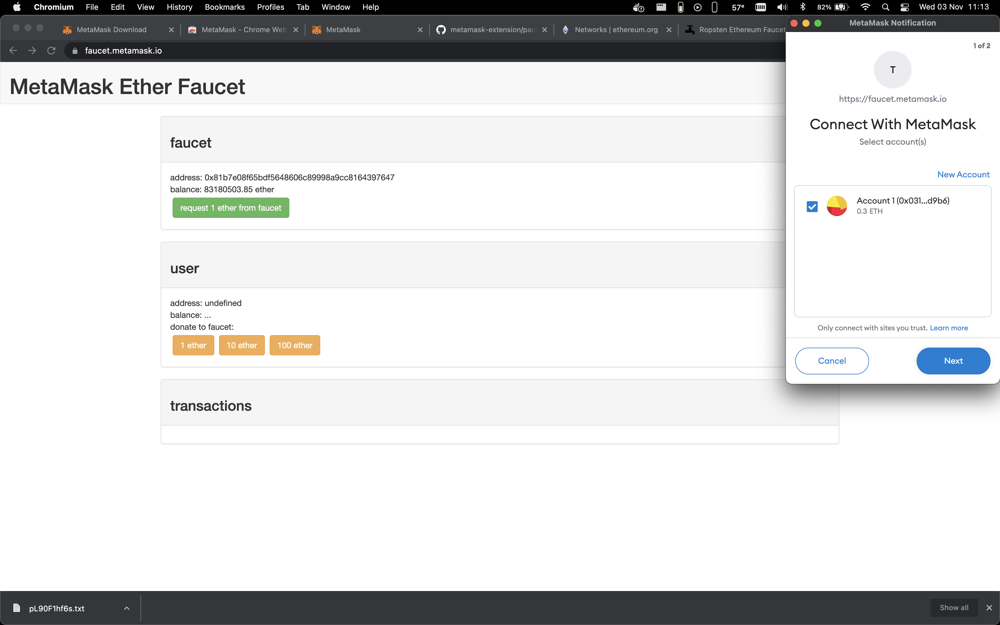

12. Connect to account

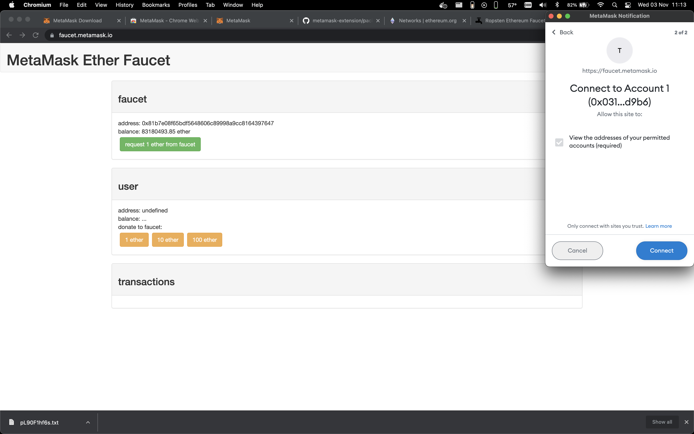

13. Account menu

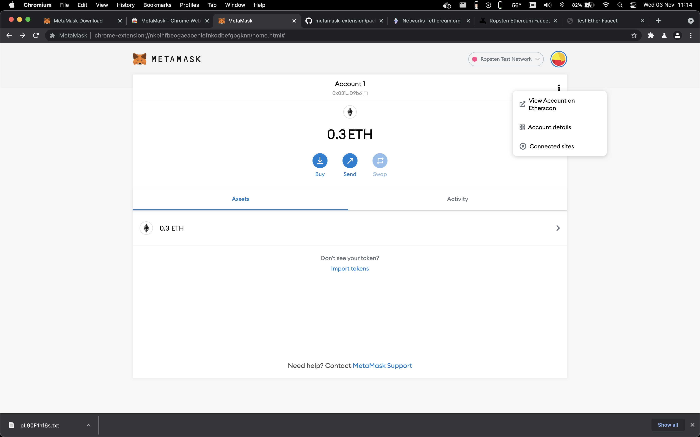

14. Transactions

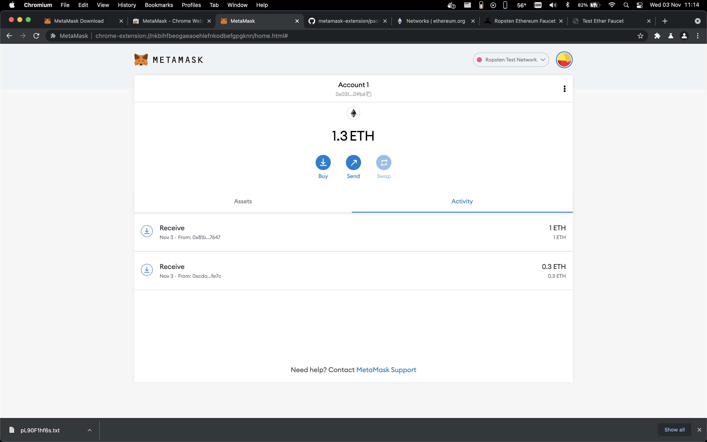

15. Global menu

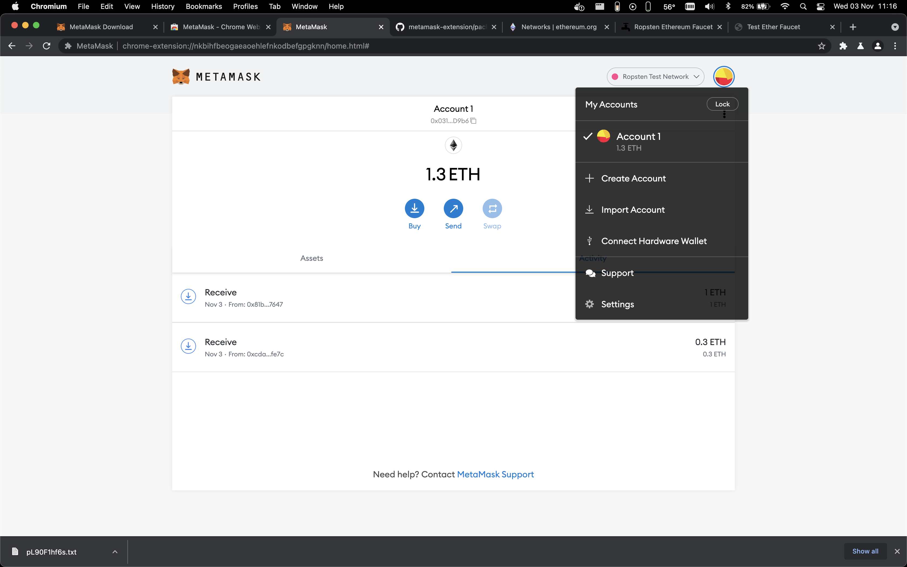

16. Lock screen

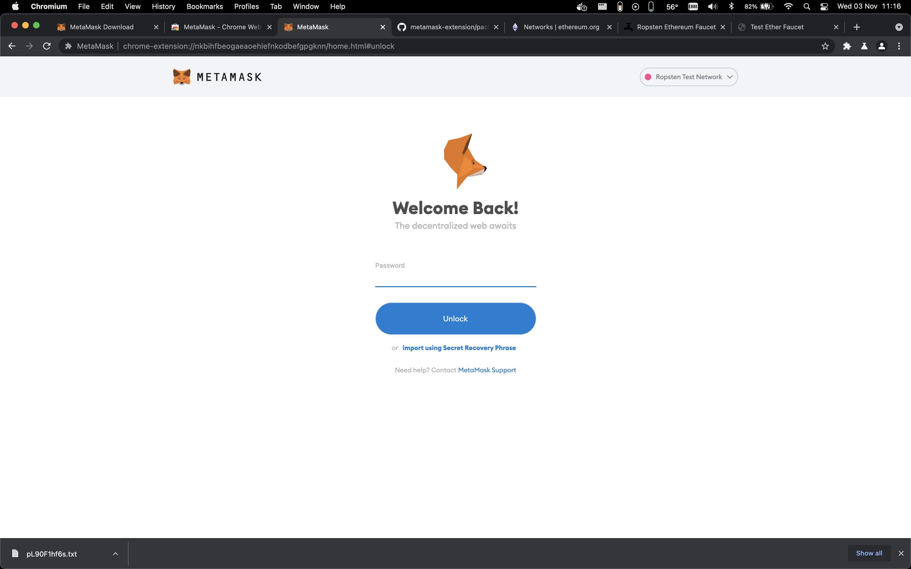
