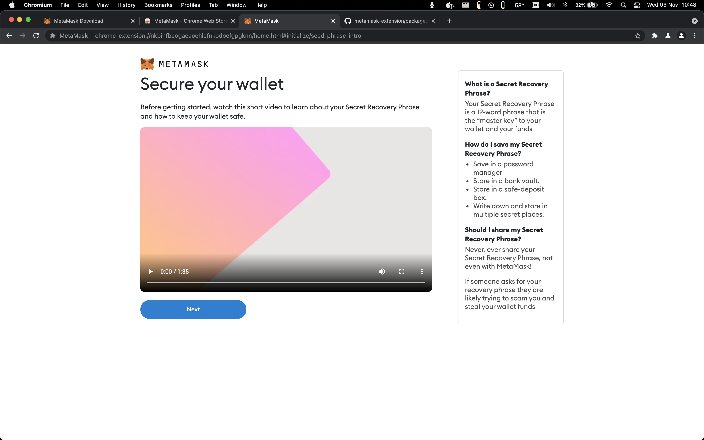
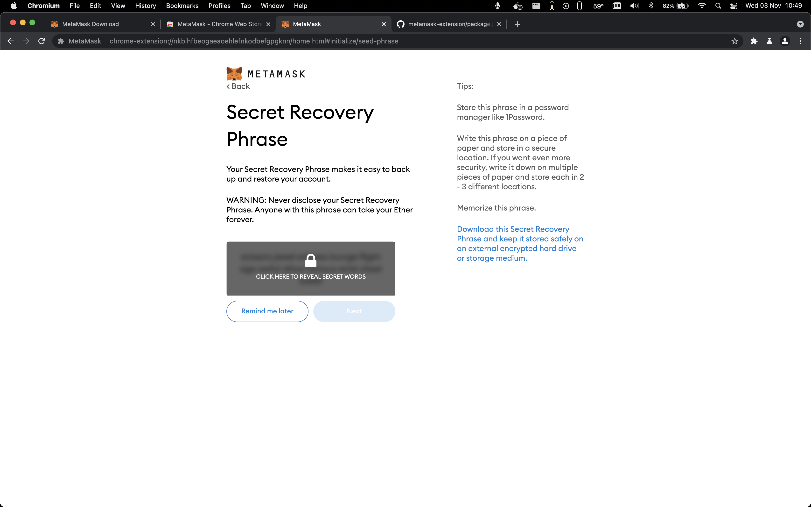

# Metamask extension flow

0. Install extension

1. Welcome

2. Import or create wallet

3. Data collection opt-in

4. Create password

5. Tutorial

6. Recovery phrase

7. Confirm recovery phrase

8. Tips

9. What's new modal

10. Wallet Dashboard

11. External site connect with metamesk

12. Connect to account

13. Account menu

14. Transactions

15. Global menu

16. Lock screen

